# Cyber Monday

## 1. 개요

다양한 할인으로 발생한 사용자들의 대량 주문 트래픽에 대해 안정적인 서비스를 제공하는 경험을 해보고자 시작한 쿠폰/세일 중심 프로젝트입니다.

사이버 먼데이는 연휴가 끝난 후 일상생활에 복귀한 소비자들에게 온라인으로 물건을 구매하도록 독려한 데서 나왔습니다. 이 서비스는 월요일에 몰려드는 사용자들에 앞서 주문에 대해 빠르고 정확한 피드백을 받도록 안정적인 서비스를 제공하는 것이 목표입니다.

## 2. 기술 스택

- JDK 21
- Spring Boot 3.5.9
- Spring Security
- Redis 7.4
- Kafka 3.9.1
- MySQL 8.4.7
- Flyway
- Amazon Web Service
- Testcontainers
- Spring Boot Actuator
- Micrometer

## 3. 사용자 시나리오

### CASE 1 : 회원가입

1. 홈 화면에서 회원가입 버튼을 누른다
2. 카카오로 가입할 수 있도록 버튼 목록이 보인다
3. 카카오로 로그인 버튼을 클릭한다
4. 클릭한 뒤 나오는 인증 화면을 통해 소셜 로그인 인증을 마친다
5. 회원 가입이 완료되면 자동으로 로그인 처리되고 홈으로 이동한다

### CASE 2 : 로그인

1. 홈에서 로그인 버튼을 누른다
2. 로그인 버튼을 클릭하면 카카오로 로그인할 수 있도록 버튼 목록이 보인다
3. 본인이 가입한 소셜 로그인 버튼을 클릭한다
4. 소셜 로그인 인증 후 로그인한다
5. 로그인 처리되고 홈으로 이동한다

### CASE 3 : 내 정보 확인

1. 앱 화면 오른쪽 위에 있는 마이 페이지 버튼을 클릭한다
2. 인증된 아이디, 적립금, 다운로드했던 쿠폰들, "주문내역" 메뉴를 확인한다

### CASE 4 : 회원 탈퇴

1. 앱 화면 오른쪽 위에 있는 마이 페이지 버튼을 클릭한다
2. "회원탈퇴" 버튼을 눌러 서비스를 탈퇴한다

### CASE 5 : 상품 조회

1. 홈 화면으로 들어간다
2. 상품의 브랜드 이름 기준으로 묶인 상품 목록들이 보여진다
3. 진열된 상품들 중 하나를 클릭하여 상세 화면으로 들어간다
4. 상세 화면에서는 해당 상품의 가격/재고/쿠폰 정보를 확인할 수 있다
   - 기본 가격은 정가로 표시된다
5. 만약 상품의 재고가 없다면 장바구니/구매하기 대신 "품절"이라는 비활성화된 버튼을 볼 수 있다

### CASE 6 : 상품 장바구니 관리

#### CASE 6-1 : 상품 상세 화면에서 장바구니 들어가기

1. 홈에서 원하는 상품을 클릭하여 상세 화면으로 들어간다
   - 만약 상품의 재고가 없다면 품절로 보인다
   - 품절 상태의 상품일 시 장바구니 담기에 실패한다
2. 상품 상세 화면에서 "장바구니 담기" 버튼을 클릭한다
3. 원하는 개수만큼 추가한 뒤 담기 버튼을 클릭한다
4. "물건이 장바구니에 담겼습니다." 라는 안내가 뜨고, 장바구니 화면으로 들어갈 수 있는 링크가 뜬다
5. 링크를 클릭하여 장바구니 화면으로 들어간다
6. 장바구니에 담긴 물건을 선택해서 "장바구니에서 삭제" 버튼을 클릭한다

#### CASE 6-2 : 홈에서 장바구니 들어가기

1. 홈 화면에서 마이페이지 옆에 있는 장바구니 버튼을 클릭하여 장바구니 화면으로 들어간다
2. 장바구니에 담긴 물건을 확인한다
3. 취소하고자 하는 물건을 선택해서 "장바구니에서 삭제" 버튼을 클릭한다

### CASE 7 : 쿠폰 다운로드

#### CASE 7-1 : 상품 상세 화면에서 브랜드 전용 쿠폰 다운로드

1. 홈에서 상품을 클릭해 상품 상세 화면으로 들어간다
2. 상품 사진 오른쪽에는 쿠폰을 다운받을 수 있는 버튼이 보인다
   - 만약 이미 다운로드 받은 쿠폰이라면 버튼은 비활성화된다
   - 쿠폰의 전체 수량이 모두 소진된 경우에는 버튼이 "소진됨" 상태로 표시된다 
3. 상품 상세 화면에서 발급된 쿠폰을 다운로드한다
   - 만약 해당 쿠폰을 이미 다운로드 받았거나 다운로드받으면 다운로드 버튼이 비활성화되며, 사용할 때까지 쿠폰을 다운로드 받을 수 없게 된다
   - 쿠폰을 사용했다면 다시 새로 받을 수 있다
   - 쿠폰을 다운받으려 할 때 순간 쿠폰이 소진되었다면 "쿠폰이 소진되었습니다"라는 안내창이 보이며, 쿠폰이 다운로드되지 않는다
     - 쿠폰 다운로드 버튼은 "소진됨" 상태로 표시된다
4. 쿠폰이 다운로드되면 "쿠폰을 성공적으로 받았습니다"라는 안내창이 보인다

#### CASE 7-2 : 프로모션 쿠폰 다운로드

1. 홈에서 일정 기간에 나오는 프로모션 소개 페이지로 들어간다
   - 끝난 프로모션은 "해당 프로모션은 종료됐습니다"라고 안내를 받는다
   - 끝난 프로모션은 쿠폰을 다운로드할 수 없다
2. 프로모션 소개 아래에는 현재 기간에 유효한 프로모션 쿠폰이 노출된다
   - 만약 이미 다운로드 받은 쿠폰이라면 버튼은 비활성화된다
   - 쿠폰의 전체 수량이 모두 소진된 경우에는 버튼이 "소진됨" 상태로 표시된다 
3. 쿠폰을 다운로드 받는다
   - 프로모션 쿠폰을 다운받으려 할 때 순간 쿠폰이 소진되었다면 "쿠폰이 소진되었습니다"라는 안내창이 보이며, 쿠폰이 다운로드되지 않는다
     - 쿠폰 다운로드 버튼은 "소진됨" 상태로 표시된다
4. 쿠폰이 다운로드되면 "쿠폰을 성공적으로 받았습니다"라는 안내창이 보인다

### CASE 8 : 상품 주문하기

#### CASE 8-1 : 상품 상세 화면에서 상품 주문

1. 홈에서 원하는 상품의 상세 화면으로 들어간다
2. "구매하기" 버튼을 누른다
3. 원하는 개수만큼 수량을 선택한다
4. "주문하기" 버튼을 눌러 주문 화면으로 들어간다
   - 버튼을 짧은 시간에 여러 번 눌러도, 동일 요청은 1회만 처리되도록(멱등하게) 동작한다
5. 주문 화면에서 배송 정보를 입력한다
6. 주문 전체에 적용할 쿠폰을 선택해 적용한다
   - 프로모션, 브랜드 등 서로 다른 종류의 쿠폰을 종합하여 최대 3장까지 선택할 수 있다
   - 다른 쿠폰을 선택해서 적용할 쿠폰을 바꿀 수 있다
7. 적립금을 사용하여 총구매 가격을 낮춘다
   - 적립금은 5천 원부터 사용할 수 있다
   - 적립금은 쿠폰 적용 후 최종 결제금액의 10%까지만 사용할 수 있다
   - 10% 이상을 넘기는 금액이면 "적립금은 최대 총 금액의 10%까지만 적용 가능합니다"는 안내가 나온다
     - 이 안내가 나오면 적립금을 다시 적용해야 한다
8. 적립금은 최대 적용하기 버튼을 누르면 최종 결제금액의 10%까지 할인한 금액이 계산되어 화면에 적용된다
9.  결제 방법을 선택하고 '결제하기'를 누르면 결제 화면으로 이동하여 결제를 진행한다
   - 버튼을 짧은 시간에 여러 번 눌러도, 동일 요청은 1회만 처리되도록(멱등하게) 동작한다
   - 결제 방법에는 카드 결제, 퀵계좌이체 중 하나를 고를 수 있다
   - 동시에 구매가 몰리면, 주문 화면까지는 들어왔더라도 결제 단계에서 품절 안내가 발생할 수 있다
10. 결제에 성공하면 구매한 각 물품의 재고가 차감된다
11. 결제를 완료하면 주문 번호가 생성되고, 결제 완료 화면으로 넘어간다
   - 결제에 사용했던 쿠폰, 적립금이 사용된다
   - 결제한 총금액의 5%만큼 적립금이 쌓인다
   - 마이 페이지 주문내역에 해당 주문 정보와 함께 "주문완료"상태의 데이터가 쌓인다

#### CASE 8-2 : 장바구니에서 물건 주문

1. 장바구니 버튼을 클릭해 장바구니로 들어간다
2. 장바구니에 담긴 물건의 개수를 원하는 만큼 조절한다
3. 장바구니에서 원하는 물건을 선택한다
4. "주문하기" 버튼을 클릭하여 주문 화면으로 들어간다
   - 버튼을 짧은 시간에 여러 번 눌러도, 동일 요청은 1회만 처리되도록(멱등하게) 동작한다
5. 주문 화면에서 배송 정보를 입력한다
6. 주문 전체에 적용할 쿠폰을 선택해 적용한다
   - 프로모션, 브랜드 등 서로 다른 종류의 쿠폰을 종합하여 최대 3장까지 선택할 수 있다
   - 다른 쿠폰을 선택해서 적용할 쿠폰을 바꿀 수 있다
7. 적립금을 사용하여 총구매 가격을 낮춘다
   - 적립금은 5천 원부터 사용할 수 있다
   - 적립금은 쿠폰 적용 후 최종 결제금액의 10%까지만 사용할 수 있다
   - 10% 이상을 넘기는 금액이면 "적립금은 최대 총 금액의 10%까지만 적용 가능합니다"는 안내가 나온다
     - 이 안내가 나오면 적립금을 다시 적용해야 한다
8. 적립금은 최대 적용하기 버튼을 누르면 최종 결제금액의 10%까지 할인한 금액이 계산되어 화면에 적용된다
9. 결제 방법을 선택하고 '결제하기'를 누르면 결제 화면으로 이동하여 결제를 진행한다
   - 버튼을 짧은 시간에 여러 번 눌러도, 동일 요청은 1회만 처리되도록(멱등하게) 동작한다
   - 결제 방법에는 카드 결제, 퀵계좌이체 중 하나를 고를 수 있다
   - 동시에 구매가 몰리면, 주문 화면까지는 들어왔더라도 결제 단계에서 품절 안내가 발생할 수 있다
10. 결제에 성공하면 구매한 각 물품의 재고가 차감된다 
11. 결제를 완료하면 주문 번호가 생성되고, 결제 완료 화면으로 넘어간다
   - 결제에 사용했던 쿠폰, 적립금이 사용된다
   - 결제한 총금액의 5%만큼 적립금이 쌓인다
   - 마이 페이지 주문내역에 해당 주문 정보와 함께 "주문완료"상태의 데이터가 쌓인다

### CASE 9 : 주문 내역 확인

1. 마이페이지로 이동한다
2. 마이페이지에서 "주문내역" 버튼을 눌러 주문 내역 화면으로 이동한다
3. 주문 완료/취소된 내역들이 보인다

### CASE 10 : 주문 취소

1. 마이 페이지로 이동한다
2. 마이페이지에서 "주문내역" 버튼을 눌러 주문 내역 화면으로 이동한다
3. 취소하길 원하는 주문 내역을 "주문취소" 버튼을 클릭하여 주문을 취소한다
   - 주문 취소는 "주문완료" 상태에서만 가능하다
4. 해당 주문 내역 상태는 "주문취소"로 변경된 것을 확인한다
   - 주문 취소가 완료되면 사용 처리된 쿠폰은 미사용으로 복구되고, 차감된 적립금은 적립금 잔액에 다시 더해진다

## 3. flow chart

### CASE 1 : 회원가입

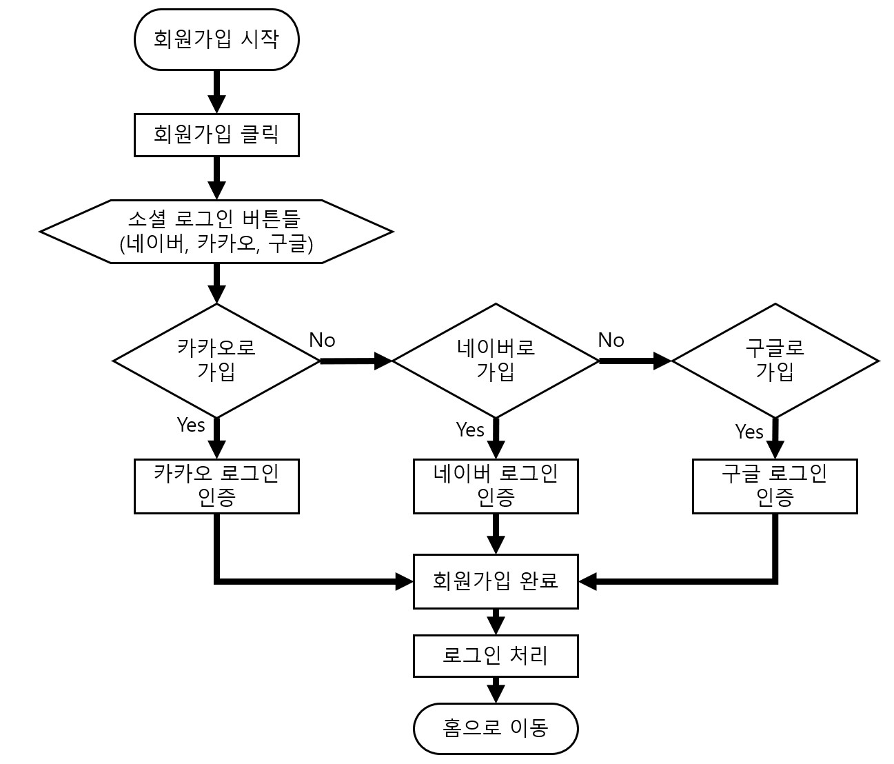

### CASE 2 : 로그인

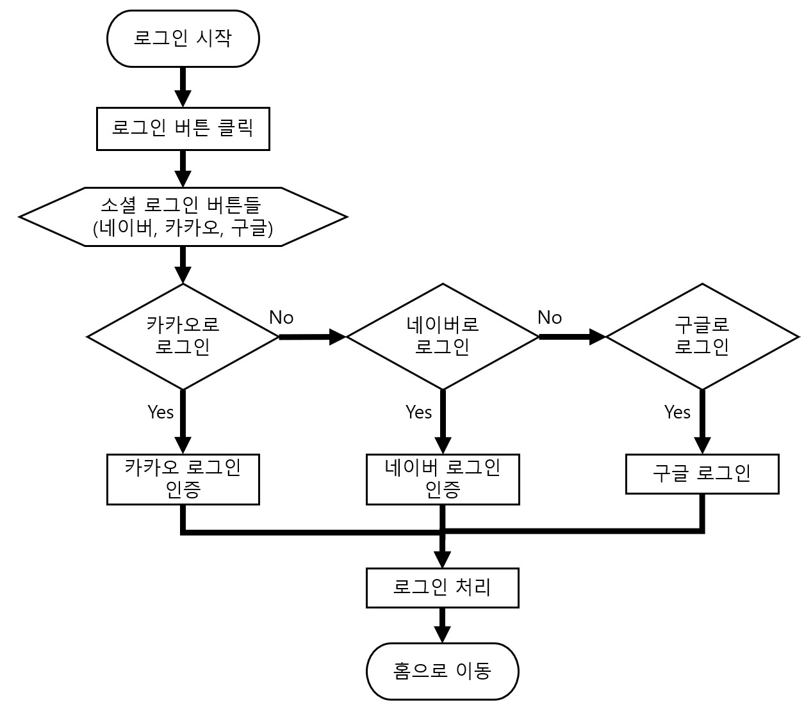

### CASE 3 : 내 정보 확인

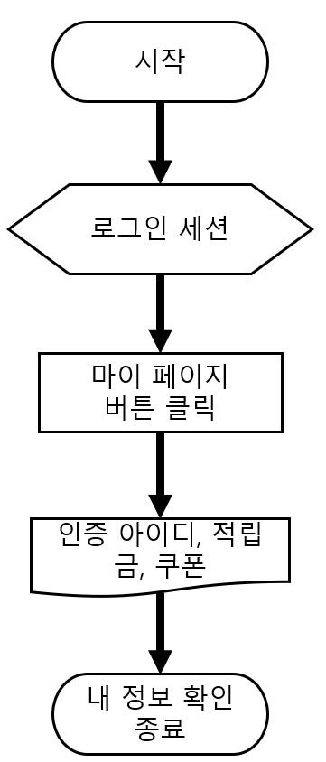

### CASE 4 : 회원탈퇴

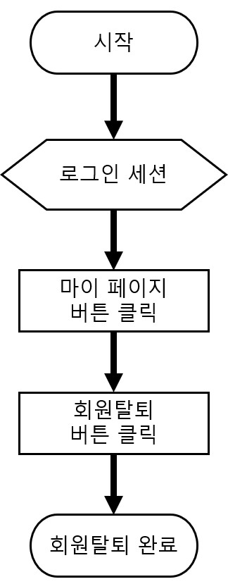

### CASE 5 : 상품조회

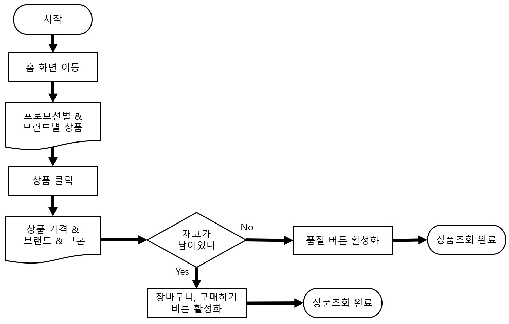

### CASE 6 : 상품 장바구니 관리

#### CASE 6-1 : 상품 상세 화면에서 장바구니 들어가기

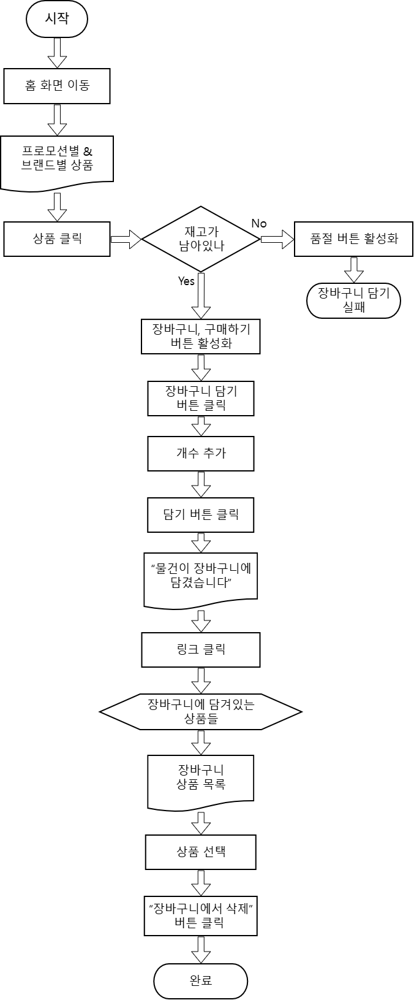

#### CASE 6-2 : 홈에서 장바구니 들어가기

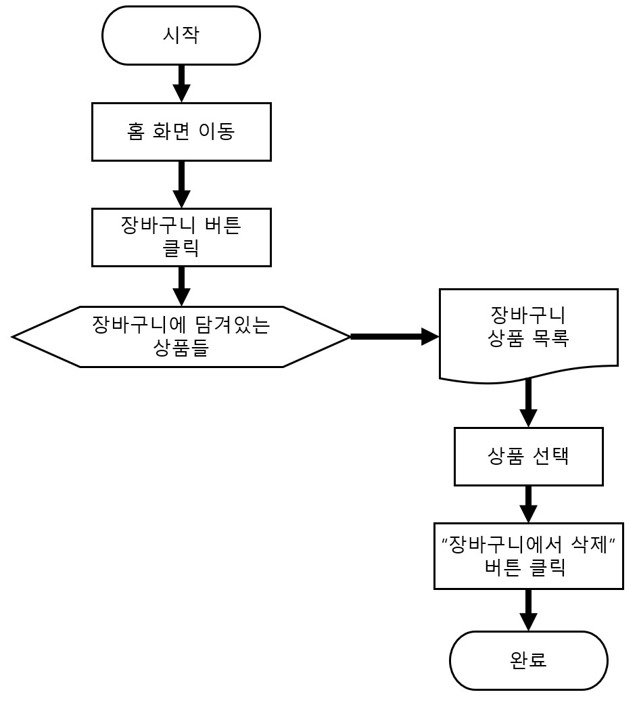

### CASE 7 : 쿠폰 다운로드

#### CASE 7-1 : 상품 상세 화면에서 브랜드 전용 쿠폰 다운로드

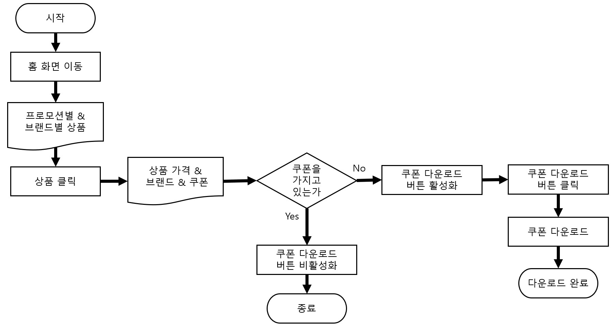

#### CASE 7-2 : 브랜드 소개 화면에서 브랜드 전용 쿠폰 다운로드

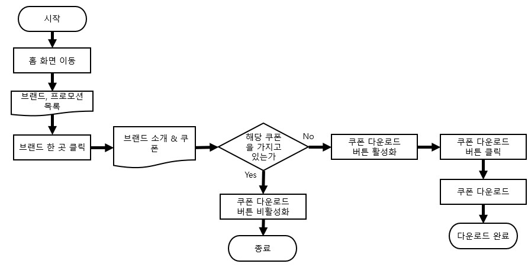

#### CASE 7-3 : 프로모션 쿠폰 다운로드

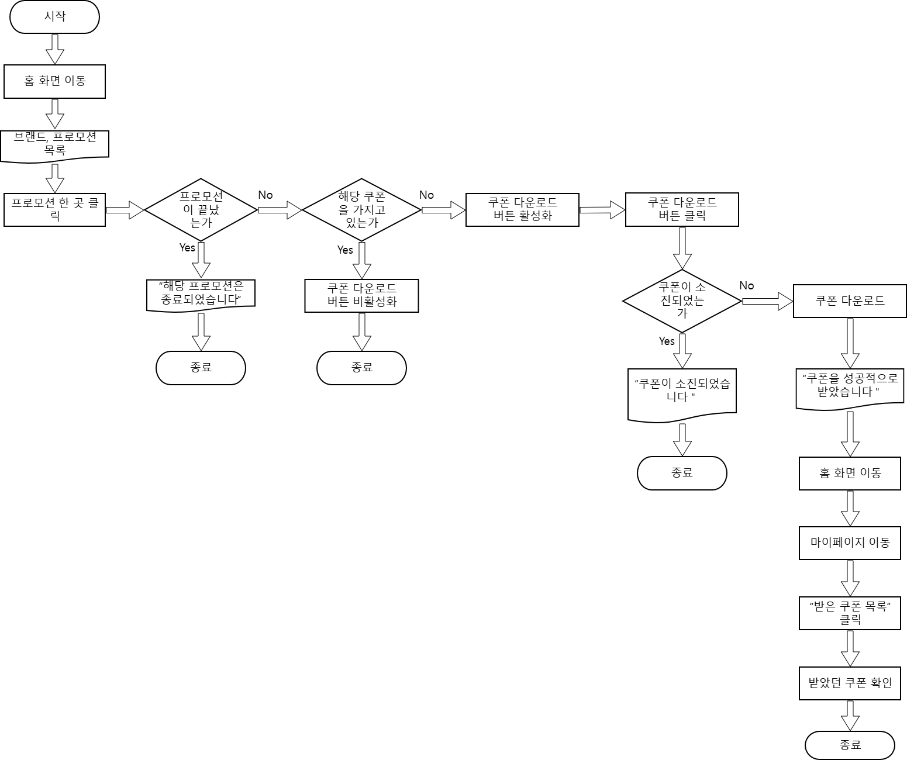

### CASE 8 : 상품 주문하기

#### CASE 8-1 : 상품 상세 화면에서 상품 주문

#### CASE 8-2 : 장바구니에서 물건 주문

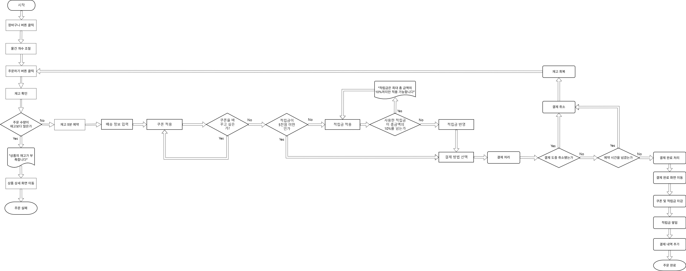

### CASE 9 : 주문 내역 확인

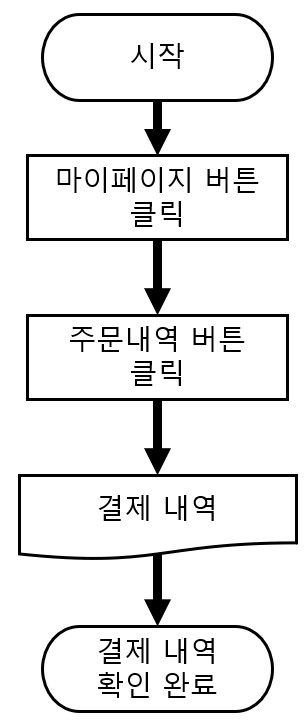

### CASE 10 : 주문 취소

## 4. API 구조도

판매자(셀러) 기능은 생략했습니다. 사용자의 화면을 중심으로 API 구조도를 나타냈습니다.

| CASE | 대분류 | 기능 | 우선순위 |
|-|-|-|-|
| 1 | 회원 | 소셜로그인 인증 | 1 |
| - | - | 인증 후 회원가입 처리 | 2 |
| - | - | 로그인 처리 | 3 |
| - | 프로모션 | 프로모션 목록 조회 | 4 |
| - | 브랜드 | 브랜드 목록 조회 | 7 |
| - | - | 브랜드 목록별 상품 조회 | 8 |
| 2 | 회원 | 소셜로그인 인증 | 1 |
| - | - | 로그인 처리 | 3 |
| 3 | 회원 | 인증된 아이디 조회 | 17 |
| - | - | 적립금 조회 | 18 |
| - | - | 소지한 쿠폰 조회 | 19 |
| 4 | 회원 | 인증된 아이디 조회 | 17 |
| - | - | 적립금 조회 | 18 |
| - | 쿠폰 | 프로모션 쿠폰 조회 | 34 |
| - | 쿠폰 | 브랜드 쿠폰 조회 | 19 |
| - | 회원 | 아이디 삭제(soft delete) | 40 |
| 5 | 프로모션 | 프로모션 목록 조회 | 4 |
| - | 브랜드 | 브랜드 목록 조회 | 7 |
| - | - | 브랜드 목록별 상품 조회 | 8 |
| - | 상품 | 상품 정보 조회 | 9 |
| - | 쿠폰 | 브랜드 쿠폰 정보 조회 | 6 |
| 6-1 | 상품 | 상품 정보 조회 | 9 |
| - | 쿠폰 | 브랜드 쿠폰 정보 조회 | 6 |
| - | 장바구니 | 장바구니에 상품 추가 | 27 |
| - | - | 장바구니 상품 조회 | 26 |
| - | - | 장바구니 상품 수량 변경 | 29 |
| - | - | 장바구니 상품 삭제 | 28 |
| 6-2 | 장바구니 | 장바구니에 상품 추가 | 27 |
| - | - | 장바구니 상품 조회 | 26 |
| - | - | 장바구니 상품 수량 변경 | 29 |
| - | - | 장바구니 상품 삭제 | 28 |
| 7-1 | 상품 | 상품 정보 조회 | 9 |
| - | 쿠폰 | 브랜드 쿠폰 정보 조회 | 6 |
| - | - | 브랜드 쿠폰 수량 검증 | 24 |
| - | - | 브랜드 쿠폰 다운로드 | 23 |
| 7-3 | 프로모션 | 프로모션 정보 조회 | 34 |
| - | - | 프로모션 기간 검증 | 35 |
| - | 쿠폰 | 프로모션 쿠폰 정보 조회 | 38 |
| - | - | 프로모션 쿠폰 수량 검증 | 37 |
| - | - | 프로모션 쿠폰 다운로드 | 39 |
| 8-1 | 상품 | 상품 정보 조회 | 9 |
| - | 쿠폰 | 브랜드 쿠폰 정보 조회 | 6 |
| - | 주문 | 상품 재고 예약 | 10 |
| - | - | 예약 시간 검증 | 11 |
| - | - | 상품 예약 취소 | 12 |
| - | 쿠폰 | 사용가능 쿠폰 조회 | 22 |
| - | 회원 | 사용가능 적립금 조회 | 13 |
| - | 결제 | 결제 처리 | 14 |
| - | 쿠폰 | 쿠폰 사용 | 25 |
| - | 회원 | 적립금 사용 | 21 |
| - | - | 주문 완료 데이터 추가 | 15 |
| - | - | 적립금 적립 | 36 |
| 8-2 | 장바구니 | 장바구니 상품 조회 | 26 |
| - | - | 장바구니 상품 수량 변경 | 29 |
| - | 주문 | 상품 재고 예약 | 10 |
| - | - | 예약 시간 검증 | 11 |
| - | - | 상품 예약 취소 | 12 |
| - | 쿠폰 | 사용가능 쿠폰 조회 | 22 |
| - | 회원 | 사용가능 적립금 조회 | 13 |
| - | 결제 | 결제 처리 | 14 |
| - | 쿠폰 | 쿠폰 사용 | 25 |
| - | 회원 | 적립금 사용 | 21 |
| - | - | 주문 완료 데이터 추가 | 15 |
| - | - | 적립금 적립 | 36 |
| 9 | 회원 | 인증된 아이디 조회 | 17 |
| - | - | 적립금 조회 | 18 |
| - | - | 소지한 쿠폰 조회 | 19 |
| - | 주문 | 주문내역 조회 | 20 |
| 10 | 회원 | 인증된 아이디 조회 | 17 |
| - | - | 적립금 조회 | 18 |
| - | - | 소지한 쿠폰 조회 | 19 |
| - | 주문 | 주문내역 조회 | 20 |
| - | - | 주문 취소 | 30 |
| - | 결제 | 결제 취소 | 31 |
| - | 회원 | 쿠폰 반환 | 32 |
| - | - | 적립금 반환 | 33 |

## 5. ERD
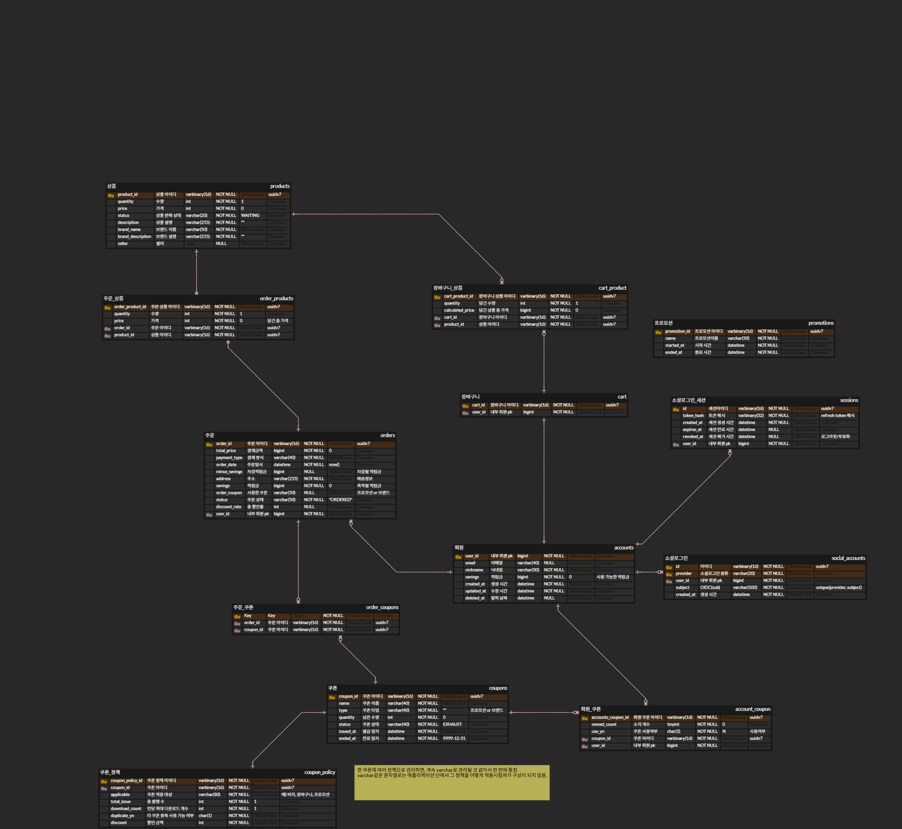

